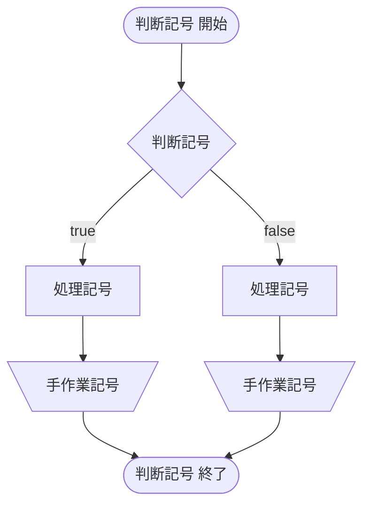
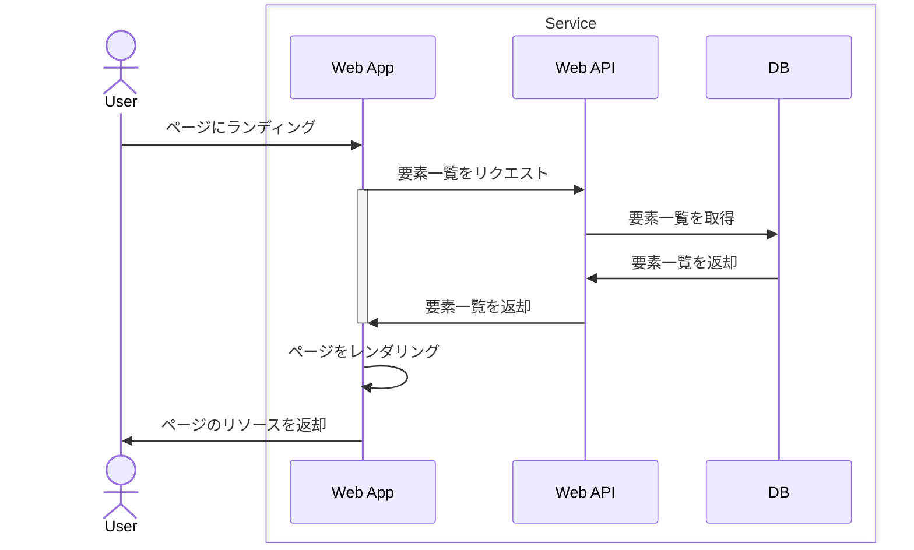

# Mermaid

## About Mermaid 

> Mermaid is a JavaScript based diagramming and charting tool that uses Markdown-inspired text definitions and a renderer to create and modify complex diagrams.
The main purpose of Mermaid is to help documentation catch up with development.

## 参考リンク

- [Mermaid | Diagramming and charting tool](http://mermaid.js.org/)

## 表現できる図・表の種類

- Flowchats / フローチャート
- Sequence Diagrams / シーケンス図
- State Diagrams / 状態遷移図

### Flowchats / フローチャート

> フローチャート（flowchart, 流れ図）は、プロセスの各ステップを箱で表し、流れをそれらの箱の間の矢印で表すことで、アルゴリズムやプロセスを表現する図である。
アルゴリズムやプロセスについて、単にその順序だけを示すものであり、全体から詳細へというような「段階的」な説明ではない（ないし、記述者が意識してそのような階層を作る必要がある）。
また、データフロー図と対比すると、より重要であるデータの流れをフローチャートは表すことがなく、操作を順に示すことでデータの流れを暗示する。
しかし、フローチャートは様々な分野の工程の解析・設計・文書化・管理に用いられている。

- [フローチャート - Wikipedia](https://ja.wikipedia.org/wiki/%E3%83%95%E3%83%AD%E3%83%BC%E3%83%81%E3%83%A3%E3%83%BC%E3%83%88)

#### 各記号と記法

| 記号名 | 記法 |
| :--- | :--- |
| 処理記号 | `id[string]` |
| 手作業記号 | `id[\string/]` |
| 開始/終了記号 | `id([string])` |
| 判断記号 | `id{string}` |

#### 記述例

### Sequence Diagrams / シーケンス図

> オブジェクト間のメッセージの流れを時系列的に表現する。イベントの発生順序やオブジェクトの生存（ライフライン、lifeline）、メッセージ（message）、イベントオカレンス（event occurrence）、実行オカレンス（execution occurrence）、相互作用オカレンス（interaction occurrence）などの記述によって、もっぱら時系列にもとづいたシステム分析・設計に使用する。

- [シーケンス図 - Wikipedia](https://ja.wikipedia.org/wiki/%E3%82%B7%E3%83%BC%E3%82%B1%E3%83%B3%E3%82%B9%E5%9B%B3)

#### 各要素と記法

| 要素名 | 用途 | 記法 |
| :--- | :--- | :--- |
| ライフライン | 使用するオブジェクトやクラス | `participant ID as Name`, `actor ID as Name` |
| グループ化 |  | `box Message`, `end` |
| メッセージ | オブジェクト間のやり取り | `ID1->>ID2: Message`, `ID1<<-ID2: Message` |
| 実行仕様 | ライフライン上で実行されている処理 | `activate ID`, `deactivate ID` |
| ノート | 補足情報 | `Note left of ID: Message` |
| 繰り返し処理 | - | `loop Message`, `end` |
| 条件分岐 | - | `alt Message`, `else Message`, `end` |
| 並行処理 | - | `par Message`, `and Message`, `end` |
| 中断処理 | - | `break Message`, `end` |
| シーケンス番号 | メッセージに番号をつける | `autonumber` |

### State Diagrams / 状態遷移図

> 状態遷移図（じょうたいせんいず、State Transition Diagram）は、有限オートマトンなどの状態機械について、その各状態を頂点とし、状態から状態への各遷移を辺としたグラフ構造に注目して、グラフィカルに表現した図である。他の表現手法として状態遷移表などがある。

- [状態遷移図 - Wikipedia](https://ja.wikipedia.org/wiki/%E7%8A%B6%E6%85%8B%E9%81%B7%E7%A7%BB%E5%9B%B3)
